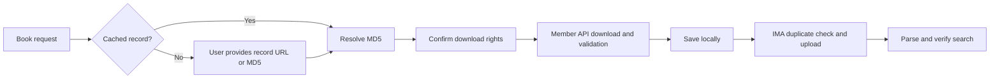

# BookBridge

> A local WorkBuddy workflow that turns a user-supplied Anna's Archive record into an authorized local download and an IMA knowledge-base entry.

[English](README.md) | [简体中文](README.zh-CN.md)

[](https://github.com/starryChenstudent/bookbridge-workbuddy-ima/releases/tag/BookBridge-v2)
[](LICENSE)
[](SKILL.md)

## Overview

BookBridge v2 accepts an official Anna's Archive `/md5/` record URL or its 32-character MD5, obtains the authorized member download URL, validates and stores the original file locally, and imports it through WorkBuddy's connected `ima-mcp` connector.

The first record supplied for a title is remembered locally. A later request for the same title can reuse that record; a different book, edition, or file format needs its own record URL or MD5.

Original files are stored by default in:

```text
Desktop/library/books/
```

Use BookBridge only for public-domain or openly licensed works, official open-access files, or content that you are legally authorized to download.

## What changed in v2

- Accept an official Anna record URL or raw MD5 as the handoff point.
- Cache non-secret title-to-record mappings in `~/.config/bookbridge/records.json`.
- Reuse a unique cached record for later requests for the same title.
- Automatically detect the downloaded PDF, EPUB, DOCX, MOBI, DJVU, RTF, FB2, or TXT format when the user does not specify it.
- Continue automatically through integrity validation, local storage, IMA duplicate checking, upload, parsing, and retrieval verification.
- Do not scrape Anna's protected HTML search page and do not require Agent Browser.

## Workflow



## Why BookBridge does not search Anna's HTML

Anna's Archive documents one stable member JSON API for obtaining a fast download URL. It requires an already selected `md5` and a member `key`; it does not accept a title, author, ISBN, or search query. See the official [API FAQ](https://tw.annas-archive.gl/faq#api) and the self-documenting [Fast Download endpoint](https://tw.annas-archive.gl/dyn/api/fast_download.json).

The website `/search` route is a human-facing HTML page protected by DDoS-Guard. It can return HTTP 403 or a JavaScript challenge and is not a stable machine-search API. BookBridge therefore does not parse that page, replay browser cookies, solve CAPTCHAs, or bypass access controls. Fully automated title search would require maintaining Anna's large Elasticsearch/MariaDB metadata index, which is intentionally outside this lightweight Skill.

## How to provide a record

Open the edition you selected on Anna's Archive and copy either:

```text
https://tw.annas-archive.gl/md5/0123456789abcdef0123456789abcdef
```

or only the final 32-character value:

```text
0123456789abcdef0123456789abcdef
```

Do not send your Anna member key, browser cookies, or temporary download URL. The record URL/MD5 identifies one specific file, so PDF and EPUB editions normally have different MD5 values.

## Requirements

- WorkBuddy with a working `ima-mcp` connector.
- Python 3.10 or later; the Python helpers use only the standard library.
- Node.js 18 or later for streaming files to Tencent Cloud COS during IMA upload.
- Active Anna's Archive membership and its member secret key for the Fast Download API.
- Optional: Calibre's `ebook-convert` for formats that must be converted to EPUB.

BookBridge does not install Python, Node.js, Calibre, a browser automation plugin, or any system dependency.

## Install

Download the [`BookBridge-v2.zip` Release asset](https://github.com/starryChenstudent/bookbridge-workbuddy-ima/releases/download/BookBridge-v2/BookBridge-v2.zip). The asset contains only the installable Skill—no README, license, Git metadata, credentials, local record cache, or downloaded books. Extract it and import the `bookbridge` directory containing `SKILL.md` into WorkBuddy.

Alternatively, clone the repository and add its root as a WorkBuddy Skill:

```bash
git clone https://github.com/starryChenstudent/bookbridge-workbuddy-ima.git
cd ./bookbridge-workbuddy-ima
```

## Anna API access and key setup

BookBridge does not grant Anna API access. Complete Anna's current membership process first, then obtain the account member secret key. Membership, quota, and availability are controlled by Anna's Archive and may change.

After installing BookBridge, check the runtime and key status:

```bash
python3 scripts/python_runner.py runtime_check.py
python3 scripts/python_runner.py configure_key.py --check
```

If the result reports `configured: false`, run:

```bash
python3 scripts/python_runner.py configure_key.py
```

Enter the key only in the hidden local terminal prompt. It is stored outside the Skill at:

```text
~/.config/annas-archive/api_key
```

Never place it in chat, `.env`, Git, an issue, or a public ZIP. IMA authorization remains managed by WorkBuddy's `ima-mcp` connector.

## Usage examples

First request for a book:

```text
Download my authorized copy of <Book Title> and add it to IMA.
Anna record: https://tw.annas-archive.gl/md5/<32-character-md5>
```

The same title later:

```text
Use the saved record for <Book Title> and add it to my default IMA knowledge base.
```

If a title has not been saved yet and no record is included, BookBridge asks once for the selected official record URL or MD5. It does not attempt remote title search. If several editions of the same title are cached, it asks which one to use.

## Project structure

```text
.
├── SKILL.md
├── agents/openai.yaml
├── references/
│   ├── api.md
│   └── ima-mcp.md
└── scripts/
    ├── annas_archive_client.py
    ├── configure_key.py
    ├── cos-upload.cjs
    ├── format_for_ima.py
    ├── library_paths.py
    ├── package_skill.py
    ├── python_runner.py
    └── runtime_check.py
```

## Security and privacy

- Public source and Release assets contain no Anna key or IMA credential.
- The local record cache contains bibliographic metadata and MD5 values only.
- Temporary download URLs and COS credentials are never shown to users or cached.
- Downloads require HTTPS and do not use proxies, torrents, browser-cookie replay, or access-control bypasses.
- A request, membership, or academic purpose alone is not download authorization.
- A failed COS upload never proceeds to IMA ingestion.

## Version

The current release is **BookBridge-v2**. **BookBridge-v1** remains available for historical reference.

## License

This project uses the [MIT License](LICENSE). Third-party services, metadata, and downloaded files remain subject to their respective terms and licenses.
