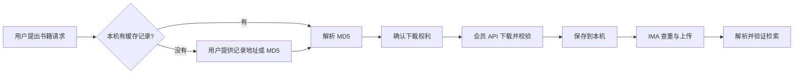

# BookBridge（本地智能读书助手）

> 面向 WorkBuddy 的本地读书工作流：把用户提供的 Anna 记录转换成授权下载，并自动导入 IMA 知识库。

[English](README.md) | [简体中文](README.zh-CN.md)

[](https://github.com/starryChenstudent/bookbridge-workbuddy-ima/releases/tag/BookBridge-v2)
[](LICENSE)
[](SKILL.md)

## 项目简介

BookBridge v2 接收 Anna's Archive 官方 `/md5/` 记录地址或 32 位 MD5，通过会员下载 API 获取文件，完成完整性校验和本地保存，再通过 WorkBuddy 已连接的 `ima-mcp` 自动导入 IMA。

一本书第一次提供的记录会保存在本机。以后再次请求同一本书时可以复用；不同书籍、不同版本或不同文件格式仍需要各自的记录地址或 MD5。

原始文件默认保存到：

```text
Desktop/library/books/
```

本项目只应用于公版、开放许可、官方开放获取，或用户已经获得合法下载授权的内容。

## v2 的主要变化

- 接收 Anna 官方记录地址或原始 MD5 作为自动化链路的起点。
- 把非敏感的“书名 → 记录”映射保存在 `~/.config/bookbridge/records.json`。
- 同一本书以后再次请求时可复用唯一缓存记录，不必重复提供 MD5。
- 用户未说明格式时，下载后自动识别 PDF、EPUB、DOCX、MOBI、DJVU、RTF、FB2 或 TXT。
- 后续自动完成校验、本地保存、IMA 查重、上传、解析和可检索验证。
- 不抓取 Anna 受保护的 HTML 搜索页，也不再依赖 Agent Browser。

## 工作流程



## 为什么不再通过 HTML 搜索书籍

Anna's Archive 官方只说明了一个稳定的会员 JSON API，用于取得快速下载地址。该接口必须已经有 `md5` 和会员 `key`，不接受书名、作者、ISBN 或搜索关键词。可查看官方 [API FAQ](https://tw.annas-archive.gl/faq#api) 和自带说明的 [Fast Download 接口](https://tw.annas-archive.gl/dyn/api/fast_download.json)。

网站 `/search` 是面向人工浏览的 HTML 页面，并受到 DDoS-Guard 保护，自动访问可能返回 HTTP 403 或 JavaScript 验证页，它不是稳定的机器搜索 API。因此 BookBridge 不解析该页面、不读取或重放 Cookie、不代解 CAPTCHA，也不绕过访问控制。若要完全自动按书名检索，就需要自行维护 Anna 规模很大的 Elasticsearch/MariaDB 元数据索引，这不适合放进轻量 Skill。

## 如何提供记录地址或 MD5

在 Anna's Archive 中打开你选中的具体版本，然后复制以下任意一种内容：

```text
https://tw.annas-archive.gl/md5/0123456789abcdef0123456789abcdef
```

或者只复制最后的 32 位值：

```text
0123456789abcdef0123456789abcdef
```

不要发送 Anna 会员 Key、浏览器 Cookie 或临时下载地址。记录地址/MD5 对应一个具体文件，因此同一本书的 PDF 与 EPUB 通常具有不同 MD5。

## 运行要求

- WorkBuddy，并已连接可用的 `ima-mcp`。
- Python 3.10 或更高版本；Python 辅助脚本只使用标准库。
- Node.js 18 或更高版本，用于 IMA 入库时把文件流式上传到腾讯云 COS。
- 有效的 Anna's Archive 会员资格及其会员 secret key，用于 Fast Download API。
- 可选：Calibre 的 `ebook-convert`，只在部分格式需要转换成 EPUB 时使用。

BookBridge 不会安装 Python、Node.js、Calibre、浏览器自动化插件或任何系统依赖。

## 安装

下载 [`BookBridge-v2.zip` Release 附件](https://github.com/starryChenstudent/bookbridge-workbuddy-ima/releases/download/BookBridge-v2/BookBridge-v2.zip)。该附件只包含可安装的 Skill 本体，不包含 README、LICENSE、Git 配置、凭证、本机记录缓存或已下载书籍。解压后，将包含 `SKILL.md` 的 `bookbridge` 目录导入 WorkBuddy。

也可以克隆仓库，再把仓库根目录添加为 WorkBuddy Skill：

```bash
git clone https://github.com/starryChenstudent/bookbridge-workbuddy-ima.git
cd ./bookbridge-workbuddy-ima
```

## 获取 Anna API 资格并配置 Key

BookBridge 不会代替 Anna's Archive 授予 API 权限。请先按 Anna 当前流程取得有效会员资格和账户 member secret key。会员资格、配额和服务可用性均由 Anna's Archive 管理，未来可能变化。

安装 BookBridge 后检查运行环境和 Key 状态：

```bash
python3 scripts/python_runner.py runtime_check.py
python3 scripts/python_runner.py configure_key.py --check
```

如果返回 `configured: false`，运行：

```bash
python3 scripts/python_runner.py configure_key.py
```

只在本机终端隐藏输入框中填写 Key。脚本会把它保存在 Skill 目录之外：

```text
~/.config/annas-archive/api_key
```

不要把 Key 写入聊天、`.env`、Git、Issue 或公开 ZIP。IMA 授权继续由 WorkBuddy 的 `ima-mcp` 连接器托管。

## 使用示例

一本书第一次使用：

```text
请下载我有权获取的《书名》，然后添加到 IMA。
Anna 记录：https://tw.annas-archive.gl/md5/<32位MD5>
```

同一本书以后再次使用：

```text
使用已经保存的《书名》记录，添加到我的默认 IMA 知识库。
```

如果这是一本尚未保存的新书，而且请求中没有记录地址或 MD5，BookBridge 会询问一次。它不会尝试远程按书名搜索。如果同一书名缓存了多个版本，BookBridge 会让用户选择具体版本。

## 项目结构

```text
.
├── SKILL.md
├── agents/openai.yaml
├── references/
│   ├── api.md
│   └── ima-mcp.md
└── scripts/
    ├── annas_archive_client.py
    ├── configure_key.py
    ├── cos-upload.cjs
    ├── format_for_ima.py
    ├── library_paths.py
    ├── package_skill.py
    ├── python_runner.py
    └── runtime_check.py
```

## 安全与隐私

- 公共源码和 Release 附件都不包含 Anna Key 或 IMA 凭证。
- 本机记录缓存只保存书目信息和 MD5。
- 临时下载 URL 和 COS 凭证不会展示给用户，也不会写入缓存。
- 下载仅使用 HTTPS，不使用代理、Torrent、Cookie 重放或访问控制绕过。
- 用户提出书名、有会员或用于学习不等于拥有下载授权。
- COS 上传失败时不会继续执行 IMA 入库。

## 版本

当前版本为 **BookBridge-v2**。**BookBridge-v1** 继续保留，仅供历史参考。

## 许可证

本项目采用 [MIT License](LICENSE)。第三方服务、元数据和下载文件仍受其各自条款及许可约束。
